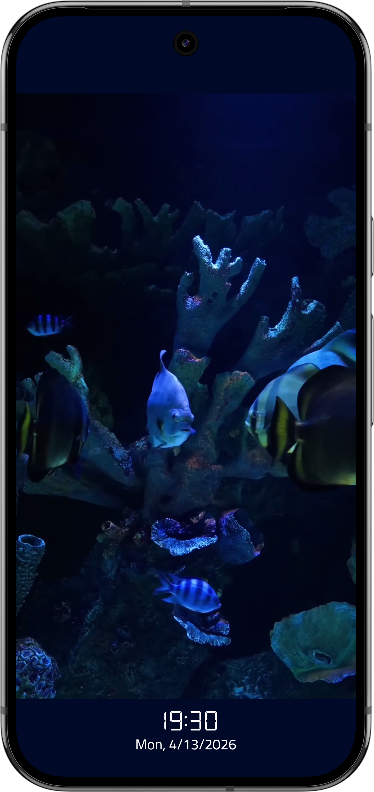
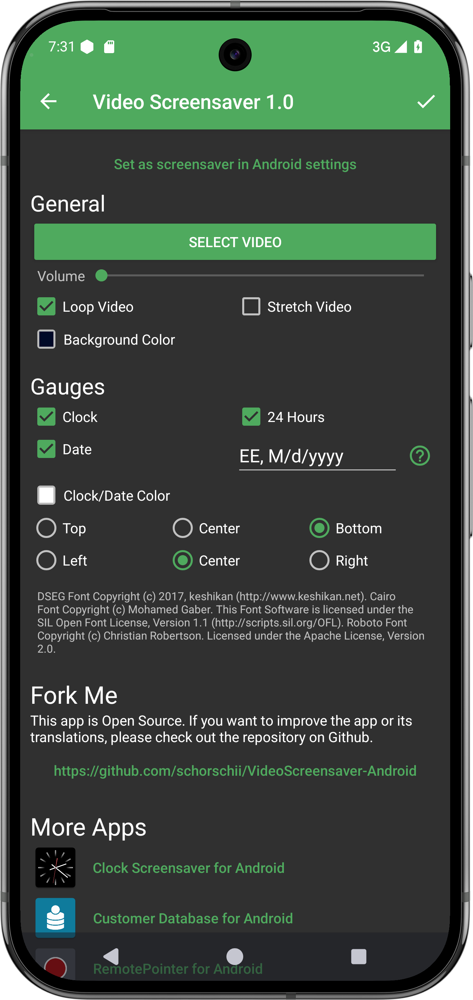

# Android Video Screensaver
[](https://play.google.com/store/apps/details?id=systems.sieber.vscreensaver)
[](https://github.com/schorschii/VideoScreensaver-Android/releases)

With this app, you can display any video as Android screensaver. In addition, you can add a digital clock and the date.

## Screenshots




## Screensaver on Amazon FireOS / FireTV
Works only up to FireOS 7.x. On FireOS 8 and newer, it currently no longer seems to be possible to set a custom screensaver.

Amazon FireOS (on FireTV devices) does currently not officially allow changing the system screensaver to another (3rd-party) app. While nobody understands this decision Amazon made, there is a workaround possible using the Android developer tools, which works up to FireOS 7. Without this workaround, the clock can still be started on FireTV devices like a normal app.

1. Enable Debugging on your FireTV.  
   All details (including how to install ADB on your computer) are described [here](https://developer.amazon.com/docs/fire-tv/connecting-adb-to-device.html).

2. Execute the following command:
   ```
   # execute this command to set this app as screensaver
   # please note: after that, the FireTV settings app still shows the Amazon screensaver, but the underlying Android system will now start the clock instead
   adb shell settings put secure screensaver_components systems.sieber.fsclock/systems.sieber.fsclock.FullscreenDream

   # if you want to restore the Amazon default screen saver, execute the following command
   adb shell settings put secure screensaver_components com.amazon.ftv.screensaver/.app.services.ScreensaverService
   ```
